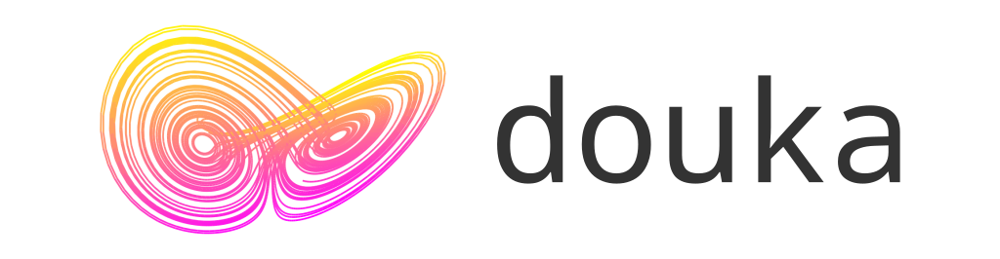

[](https://github.com/MaterialsModellingLab/douka/actions/workflows/ci.yaml)



## Overview
`douka` is a command-line interface (CLI) tool designed for data assimilation, providing a suite of commands to initialize, predict, filter, and generate observation data for ensemble models.


## Usage
```shell
$ douka --help
douka [Command]

Command:
   init        Provide initial distribution
   predict     Prediction step for an ensemble model
   filter      Filter state vectors with observation data
   obsgen      Generate observation data for twin experiment

Options:
   --help      (Opt) Print help message
   --version   (Opt) Print version
```


## Supported Platforms
- `Linux`
- `macOS`

## Install Dependencies
### Build Tools
- `CMake`
- `Ninja`
- C++ Compiler
  - `C++17`
### Test Tools
- Google Test
### Benchmark Tools
- Google Benchmark
- GPerfTools

### Dependent Libraries
- `Eigen3`
- `nlohmann-json`

## Build
### x86 or ARM platforms
```shell
cmake --preset release
cmake --build build/release
```

> [!TIP]
> If Intel MKL is installed, you can use it by setting the following option:
> ```shell
> source /opt/intel/oneapi/mkl/latest/env/vars.sh
> cmake --preset release -DDOUKA_USE_MKL=ON
> cmake --build build/release
> ```

## Install
After building, you can install the CLI tool with the following command:
```shell
cmake --install build/release
```
By default, douka will be installed in `~/.local` directory.

> [!TIP]
> If you change the installation directory, you can use the following command to load the environment variables:
```shell
source <INSTALLED_DIR>/env/douka/setup-env.sh
```

## Test
```shell
cmake --preset debug --fresh
cmake --build build/debug
ctest --preset default
```

## Benchmark
```shell
cmake --preset release -DBUILD_BENCHMARK=ON --fresh
cmake --build build/release
run-parts ./build/benchmark
```
