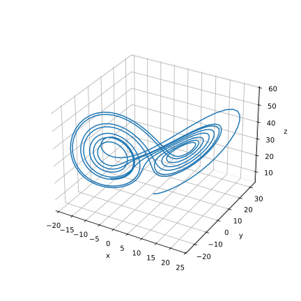
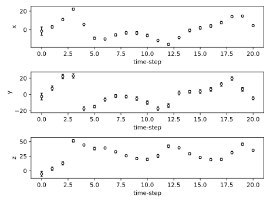

.. _create-plugin:

#################
Create own plugin
#################

``douka`` is a platform that provides fundamental algorithm for data assimilation, requiring users to add plugins according to their specific applications.
This page explains how to create custom-made plugins for ``douka``.

**************
Lorenz63 model
**************

Here we will create a plugin for the Lorenz63 model as an example.

.. TODO Insert a figure of the Lorenz63 model

  Lorenz63 model

The Lorenz63 model is a simple three-dimensional dynamical system that exhibits chaotic behavior.
The state vector of the Lorenz63 model is defined as :math:`(x, y, z)`, and the model equations are given by:

.. math::

  \begin{aligned}
  \frac{\partial x}{\partial t} &= \sigma (y - x), \\
  \frac{\partial y}{\partial t} &= x (\rho - z) - y, \\
  \frac{\partial z}{\partial t} &= x y - \beta z,
  \end{aligned}

where :math:`\sigma`, :math:`\rho`, and :math:`\beta` are the model parameters.

*****************************
Clone the template repository
*****************************

Clone the template repository from the following URL:

.. code-block:: bash

  git clone https://github.com/MaterialsModellingLab/douka_plugin_template.git
  cd douka_plugin_template

The template repository contains the following files:

- ``CMakeLists.txt``: CMake configuration file for building the plugin.
- ``src/plugin.cc``: Source code of the plugin.
- ``param``: Folder for the data assimilation parameters.
- ``script``: Sample script for running the data assimilation.

***************************
Step 1: Set the plugin name
***************************

Change the name of the plugin in the following files:

- ``CMakeLists.txt``: Change the project name and its description in the ``project`` command. By default, the project name is ``template``.

.. code-block:: cmake
  :emphasize-lines: 3-4

  cmake_minimum_required(VERSION 3.27 FATAL_ERROR)
  # TODO(User) Change the project name and its description
  project(template VERSION 0.0.0 LANGUAGES CXX
    DESCRIPTION "Data Assimilation Plugin Template")

  if(CMAKE_INSTALL_PREFIX_INITIALIZED_TO_DEFAULT)
    set(CMAKE_INSTALL_PREFIX "$ENV{HOME}/.local/" CACHE PATH "Default install path" FORCE)
  endif()

  # Define executable name for different platforms
  set(DOUKA_PLUGIN_NAME "${PROJECT_NAME}")

  # CMake Local Module Imports
  include(${CMAKE_SOURCE_DIR}/cmake/clang_format.cmake)
  include(${CMAKE_SOURCE_DIR}/cmake/cppcheck.cmake)
  include(${CMAKE_SOURCE_DIR}/cmake/dependencies.cmake)

  set(TARGET ${DOUKA_PLUGIN_NAME})
  add_library(${TARGET} SHARED)
  target_sources(${TARGET} PRIVATE ${CMAKE_SOURCE_DIR}/src/plugin.cc)
  target_link_libraries(${TARGET} PUBLIC douka::plugin_interface)

  douka_plugin_install(${DOUKA_PLUGIN_NAME})
  douka_plugin_status(${DOUKA_PLUGIN_NAME})

Here, we will change the project name to ``my_lorenz63`` as an example. Then the ``CMakeLists.txt`` file will be as follows:

.. code-block:: cmake

  project(my_lorenz63 VERSION 0.0.0 LANGUAGES CXX
    DESCRIPTION "Data Assimilation Plugin For Lorenz63")

****************************
Step 2: Implement the plugin
****************************

Implement the plugin in the ``src/plugin.cc`` file.

.. code-block:: cpp
  :emphasize-lines: 12-13, 24-25

  #include <douka/plugin_interface.hh>

  namespace douka::plugin {
  class MyPlugin : public PluginInterface {
  public:
    /**
     * @brief Set the option for simulation. This method is called before the predict process.
     *
     * @param opt_file : Option file path given by --plugin_param option
     */
    bool set_option(const std::string &opt_file) override {
      // TODO(User) Read the option file and set the parameters
      (void)opt_file;  // Replace this line with your implementation
      return true;
    }

    /**
     * @brief Make a prediction of the next time-step ensemble member.
     *
     * @param s : The vector of state mean value
     * @param n : The noise vector
     */
    bool predict(std::vector<double> &s, [[maybe_unused]] const std::vector<double> &n) override {
      // TODO(User) Implement the prediction process
      (void)s;  // Replace this line with your implementation
      return true;
    }
  };
  }; // namespace douka::plugin

  // Register the plugin
  #include <douka/plugin_register_macro.hh>
  DOUKA_PLUGIN_REGISTER(douka::plugin::MyPlugin)

Since we want to use the Lorenz63 model for the prediction of the system, the ``predict`` method will be implemented as follows:

.. code-block:: cpp

  bool predict(std::vector<double> &s, [[maybe_unused]] const std::vector<double> &n) override {
    if (s.size() != 3 || n.size() != 3) {
      std::cerr << "The state vector size is not 3." << std::endl;
      return false;
    }
    const double sigma = 10.0;
    const double rho = 28.0;
    const double beta = 8.0 / 3.0;

    const double x = s[0] + n[0];
    const double y = s[1] + n[1];
    const double z = s[2] + n[2];

    s[0] = sigma * (y - x);
    s[1] = x * (rho - z) - y;
    s[2] = x * y - beta * z;

    return true;
  }

You can also fix the ``set_option`` method to read the option file and set the parameters ``sigma``, ``rho`` and ``beta``.

************************************
Step 3: Build and install the plugin
************************************

Build the plugin using the following commands:

.. tab-set::

    .. tab-item:: macOS
        :sync: macOS

        .. code-block:: bash

          cmake --preset release
          cmake --build build/release
          cmake --install build/release

    .. tab-item:: Ubuntu22.04 / 24.04
        :sync: ubuntu

        .. code-block:: bash

          cmake --preset release
          cmake --build build/release
          cmake --install build/release

    .. tab-item:: Fedora
        :sync: fedora

        .. code-block:: bash

          cmake --preset release
          cmake --build build/release
          cmake --install build/release

    .. tab-item:: A64FX Platform
        :sync: a64fx

        Please note that the following commands should be executed on the login node for cross-compilation.

        .. code-block:: bash

          cmake --preset a64fx-release
          cmake --build build/a64fx-release
          cmake --install build/a64fx-release

Now you have successfully created your own plugin for ``douka``.
The plugin will be installed under ``~/.local/lib/douka/plugin`` by default.

************************
Step 4: Setup parameters
************************

The data assimilation parameters are defined in the ``param`` folder.
Mainly, the parameters are divided into three files: ``param.obsgen.json``, ``param.init.json``, and ``param.predict.json`` for each execution step.
Here we will set the parameters for the Lorenz63 model.

Generate observational data
===========================

Edit the ``param/param.obsgen.json`` file to set the parameters for generating observational data.
If you wish to apply data assimilation using existing observational data, you may skip this step.

This files provide  parameters for generating the observational data to execute twin experiment.
If you want to add some noise to the observational data, you can edit the observation error covariance matrix ``R`` to non-zero values.

.. code-block:: JSON
  :caption: param/param.obsgen.json

  {
    "name": "my_lorenz63",
    "seed": 10,
    "k": 3,
    "l": 3,
    "t": 20,
    "x0": [ 1.0, 3.0, 5.0 ],
  }

After setting the parameters, you can run the following script to generate simulation based observational data:

.. code-block:: bash

  ./script/obsgen.sh my_lorenz63
  # => result will be saved under ./output/obs folder

Generate initial distribution
=============================

Edit the ``param/param.init.json`` file to set the parameters for ``douka``.
This files provide  parameters for generating the initial distribution of the ensemble.

.. code-block:: JSON
  :caption: param/param.init.json

  {
    "name": "my_lorenz63",
    "seed": 1,
    "N": 100,
    "k": 3,
    "x0": [ -1.0, -3.0, -5.0 ],
    "V0": [ 20.0, 20.0, 20.0 ]
  }

Then you can run the following script to generate the initial distribution of the ensemble:
Since we set the number of ensemble members to ``N=100``, 100 of the initial state files will be generated.

.. code-block:: bash

  ./script/init.sh
  # => result will be saved under ./output/init folder

Setup parameter for prediction Step
===================================

Edit the ``param/param.predict.json`` file to set the parameters for prediction step.
Here you can set the covariance matrix ``Q`` to introduce the system error.

.. code-block:: JSON
  :caption: param/param.predict.json

  {
    "name": "my_lorenz63",
    "k": 3,
    "seed": 1,
    "Q": [5.0, 5.0, 5.0]
  }

Setup parameter for Filtering Step (EnKF)
=========================================

Edit the ``param/param.filter.json`` file to set the parameters for filtering step.
Here we will use the Ensemble Kalman Filter (EnKF) for the data assimilation.
``R`` is implemented to express the observation error covariance matrix.
The number of ensemble members should be equivalent to the value we set in the ``param.init.json`` file.

.. code-block:: JSON
  :caption: param/param.filter-enkf.json

  {
    "name": "my_lorenz63",
    "seed": 1,
    "N": 100,
    "l": 3,
    "k": 3,
    "R": [10.0, 10.0, 10.0],
  }

Those are the all parameters you need to set for the Lorenz63 model.
Here, the initial mean value of state vector ``x0`` or covariance matrix ``V0``, ``Q``, and ``R`` are arbitrarily set and can be freely changed to see how the data assimilation works.
You can also set the parameters for the other models in the same way.

*********************************
Step 5. Run the data assimilation
*********************************

The data assimilation can be executed by running the following script:

.. code-block:: bash

  ./script/run.sh my_lorenz63
  # => result will be saved under ./output/state folder

Executing this command iteratively performs the Prediction Step and Filtering Step for each piece of observational data, resulting in the output of a state vector file.

*****************************
Step 6. Visualize the results
*****************************

Visualization of the state vector is possible by aggregating the state files located in the output/state folder.
Here is a sample program that displays the estimation results for :math:`(x, y, z)`, respectively.
Run the following command to visualize at the project root directory:

.. code-block:: python
  :caption: plot.py

  import json

  import matplotlib.pyplot as plt
  import numpy as np

  def main():
      NAME = "my_lorenz63"
      T = 20
      N = 100

      x = []
      t_list = np.arange(T + 1)
      for t in t_list:
          x_tmp = []
          for n in range(N):
              filename = "{}_{:04}_{:06}_{:06}.json".format(NAME, n, t, t)
              with open("output/state/{}".format(filename)) as f:
                  data = json.load(f)
                  x_tmp.append(data["x"])
          x.append(x_tmp)

      x = np.array(x)
      x_mean = np.mean(x, axis=1)
      x_std = np.std(x, axis=1)

      fig = plt.figure()
      axes = fig.subplots(3, 1)
      for i, label in enumerate(["x", "y", "z"]):
          axes[i].set_xlabel("time-step")
          axes[i].set_ylabel(label)
          axes[i].errorbar(
              t_list,
              x_mean[:, i],
              yerr=x_std[:, i],
              capsize=2,
              fmt="o",
              markersize=4,
              ecolor="black",
              markeredgecolor="black",
              color="w",
          )

      plt.tight_layout()
      plt.show()

  if __name__ == "__main__":
      main()

    Plot of the state vector
