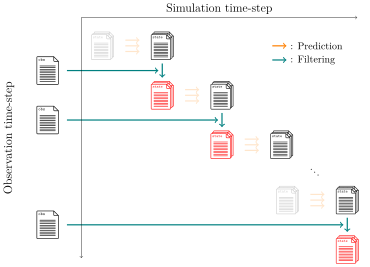

.. _usage-filter:

:bdg-primary:`Main Process`

******************
``filter`` command
******************

   Overview diagram of file input/output for the ``filter`` command.
   Black\: input files. Red\: output files.

This command will correct the predicted ensemble using the observation data.
The corrected ensemble will be saved in the directory specified by the ``--output`` option.

This command will update the state files as follows for instance:

- ``${NAME}_0000_000001_000000.json`` -> ``${NAME}_0000_000001_000001.json``

The last 2 digits separated by ``_`` are corresponding to the time step of simulation time and the observation time.
Here the observation time will be incremented by 1.

.. code-block:: bash

  douka filter [Options]
  Description:
     Filter state vectors with observation data

  Options:
     --state       Input state vector json file
     --param       Input parameter json files
     --obs         Input observation json file
     --filter      (Opt) Filter [enkf|particle] (default=enkf)
     --output      (Opt) Output path (default='output')
     --force       (Opt) Overwrite existing file
     --help        (Opt) Print help message

Since this command is designed to perform filtering step for all ensembles.
The user can now specify the ensemble id with specific placeholder ``%04d`` as follows:

.. code-block:: bash
  :caption: Example of ``filter`` command for all ensembles

  #!/bin/bash
  douka filter \
    --state        output/state/${PLUGIN_NAME}_%04d_000001_000000.json \
    --param        param/param.filter.json \
    --obs          output/obs/obs.json \
    --filter       enkf \
    --output       output/state

Parameter file given by the ``--param`` option should contain the following fields.

.. jsonschema:: ../../schemas/douka.filter-enkf.json
  :auto_reference:
  :auto_target:

Here the bold text in properties indicates the required parameters.
The other parameters are optional.
The definitions of each parameter are described in :ref:`json-schema-type`.
