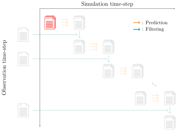

.. _usage-init:

:bdg-secondary:`Pre Process`

****************
``init`` command
****************

   Overview diagram of file output for the ``init`` command.
   Red\: output files.

This command will generate the initial distribution of state vectors.
By executing this command, ``N`` state files will be generate under the directory given by the ``--output`` option.

.. code-block:: bash

  douka init [Options]
  Description:
     Provide initial distribution

  Options:
     --param       Input parameter json files
     --output      (Opt) Output path (default='output')
     --force       (Opt) Overwrite existing file
     --help        (Opt) Print help message

This command will generate state files with the following naming convention
Those files will be the input for the ``predict`` command.

- ``${NAME}_0000_000000_000000.json``
- ``${NAME}_0001_000000_000000.json``
- ...
- ``${NAME}_$(printf %04d $((N - 1)))_000000_000000.json``

Parameter file given by the ``--param`` option should contain the following fields.

.. jsonschema:: ../../schemas/douka.init.json
  :auto_reference:
  :auto_target:

Here the bold text in properties indicates the required parameters.
The other parameters are optional.
The definitions of each parameter are described in :ref:`json-schema-type`.
