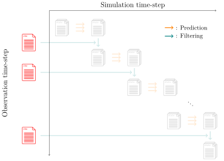

.. _usage-obsgen:

:bdg-secondary:`Pre Process`

******************
``obsgen`` command
******************

   Overview diagram of file output for the ``obsgen`` command.
   Red\: output files.

This command will generate synthetic observation data for the twin experiment.
The observation data is computed by the system model plugin given by the user via the ``--plugin`` option.

.. code-block:: bash

  douka obsgen [Options]
  Description:
     Generate observation data for twin experiment

  Options:
     --param           Input parameter json files
     --plugin          System model plugin
     --plugin_option   (Opt) Plugin option json file
     --output          (Opt) Output path (default='output')
     --force           (Opt) Overwrite existing file
     --help            (Opt) Print help message

This command will generate observation data files with the following naming convention.
Here ``T`` is the number of time steps to generate the observation data for the twin experiment, which is defined in the parameter file.
The generated observation data will be saved in the directory specified by the ``--output`` option.

- ``${NAME}_obs_000000.json``
- ``${NAME}_obs_000001.json``
- ...
- ``${NAME}_obs_$(printf %06d T).json``

Those files will be the input for the ``filter`` command.

Parameter file given by the ``--param`` option should contain the following fields.

.. jsonschema:: ../../schemas/douka.obsgen.json
  :auto_reference:
  :auto_target:

Here the bold text in properties indicates the required parameters.
The other parameters are optional.
The definitions of each parameter are described in :ref:`json-schema-type`.
