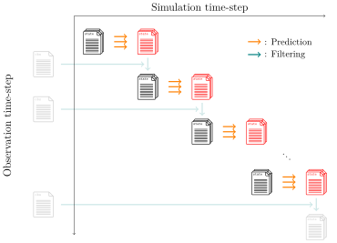

.. _usage-predict:

:bdg-primary:`Main Process`

*******************
``predict`` command
*******************

   Overview diagram of file input/output for the ``predict`` command.
   Black\: input files. Red\: output files.

This command will make state prediction using the system model plugin given by the user via the ``--plugin`` option.
The predicted state vector will be saved in the directory specified by the ``--output`` option.
This command will update the state files as follows for instance:

- ``${NAME}_0000_000000_000000.json`` -> ``${NAME}_0000_000001_000000.json``

Here, the last 2 digits separated by ``_`` are corresponding to the time step of simulation time and the observation time.
So the simulation time will be incremented by 1.

.. code-block:: bash

  douka predict [Options]
  Description:
     Prediction step for an ensemble model

  Options:
     --state         Input state vector json file
     --param         Input parameter json files
     --plugin        System model plugin
     --plugin_param  (Opt) Plugin option json file
     --output        (Opt) Output path (default='output')
     --force         (Opt) Overwrite existing file
     --help          (Opt) Print help message

Since this command is designed to perform prediction step for a single ensemble.
Therefore, to perform prediction step for ``N`` ensembles, it must be executed ``N`` times.
The following script is an example of how to execute the ``predict`` command for ``N`` ensembles.

.. code-block:: bash
  :caption: Example of ``predict`` command for ``N`` ensembles

  #!/bin/bash
  for (( i = 0; i < N; i++)); do
    STATE_FILE=$(printf ${PLUGIN_NAME}_%04d_000000_000000.json $i)
    douka predict \
      --state        output/state/${STATE_FILE} \
      --param        param/param.predict.json \
      --plugin       ${PLUGIN_NAME} \
      --plugin_param param/param.plugin.json &
  done
  wait

Here we run the ``predict`` command in parallel using the ``&`` operator which allows us to run multiple commands in the background and process parallelization is achived.

Parameter file given by the ``--param`` option should contain the following fields.

.. jsonschema:: ../../schemas/douka.predict.json
  :auto_reference:
  :auto_target:

Here the bold text in properties indicates the required parameters.
The other parameters are optional.
The definitions of each parameter are described in :ref:`json-schema-type`.
