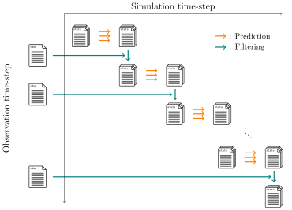

.. _usage:

###########
Basic usage
###########

``douka`` has a command line interface (CLI) for users to run the program.
The CLI is designed to be user-friendly and easy to use.
The following sections describe the usage of the CLI.

``douka`` execute the entire data assimilation process with the following sub-commands:

.. code-block:: bash

  douka [Command]

  Command:
     init        Provide initial distribution
     predict     Prediction step for an ensemble model
     filter      Filter state vectors with observation data
     obsgen      Generate observation data for twin experiment

  Options:
     --help      (Opt) Print help message
     --version   (Opt) Print version

The commands shown above are related to the each step of the data assimilation process as shown in the figure below.

   Overview diagram of the CLI and the data assimilation process.

``douka`` will handle the state vectors and observation data as files.
The following figure shows the file handling overview for the data assimilation process.

   Overview diagram of file input/output for the data assimilation process.

By executing the ``predict`` command, the state vector's timestamp will be incremented in simulation time space.
In case of the ``filter`` command, the state vector's timestamp will be incremented in observation time space.
By executing those 2 commands in a loop, the time series of state vectors will be generated.

Following sections describe the usage of each command in detail.

- :bdg-secondary:`Pre Process`
   - :doc:`usage-obsgen`
   - :doc:`usage-init`

- :bdg-primary:`Main Process`
   - :doc:`usage-predict`
   - :doc:`usage-filter`

State and observation files contain the following fields.

.. jsonschema:: ../../schemas/douka.state.json
  :auto_reference:
  :auto_target:

.. jsonschema:: ../../schemas/douka.obs.json
  :auto_reference:
  :auto_target:

The definitions of each parameter are described in :ref:`json-schema-type`.
